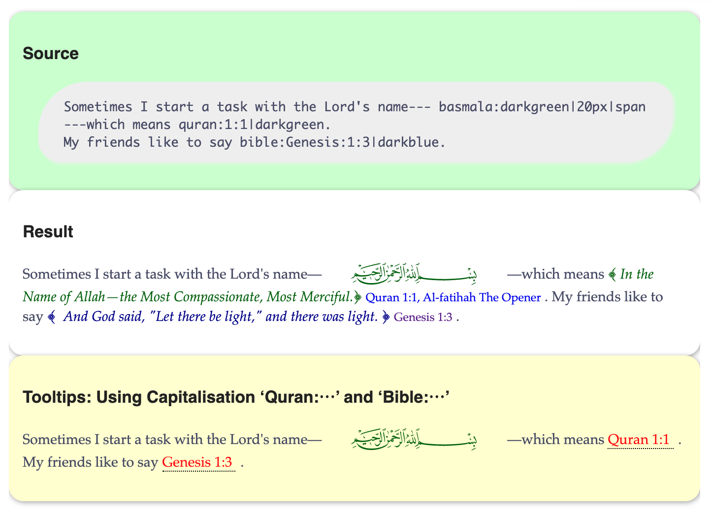
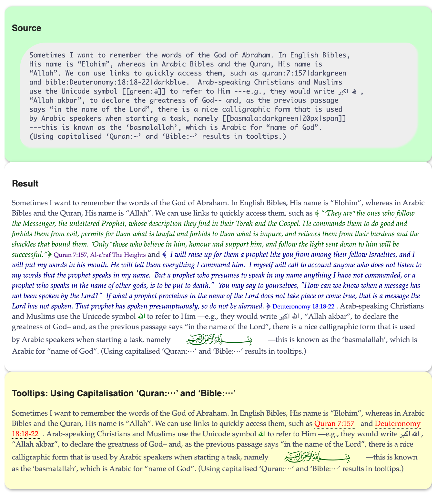

<h1> An Emacs interface to the Quran and the Bible: Org-mode links, tooltips, and Lisp look-ups </h1>

Let's use Org-mode links to look-up Quranic and Biblical verses!

“Live” examples & documentation: <https://alhassy.github.io/holy-books/>

# Table of Contents

1.  [Short Example](#Short-Example)
2.  [Long Example](#Long-Example)
3.  [Summary](#Summary)
    1.  [Installation Instructions](#Installation-Instructions)
    2.  [Bye!](#Bye)

# Short Example

# Long Example

# Summary

> The full article may be read as
>  &#x2014;or visit the
> repo  .

<table border="2" cellspacing="0" cellpadding="6" rules="groups" frame="hsides">

<colgroup>
<col  class="org-left" />

<col  class="org-left" />
</colgroup>
<thead>
<tr>
<th scope="col" class="org-left">Link</th>
<th scope="col" class="org-left">Action</th>
</tr>
</thead>

<tbody>
<tr>
<td class="org-left"><code>quran:chapter:verse</code></td>
<td class="org-left">Retrive a verse from the Quran</td>
</tr>

<tr>
<td class="org-left"><code>bible:book:chapter:verse</code></td>
<td class="org-left">Retrive a verse from the Bible</td>
</tr>

<tr>
<td class="org-left"><code>[[basmala:]]</code></td>
<td class="org-left">Produce the Basmala ligature</td>
</tr>
</tbody>
</table>

These each take optional arguments separated by ‘|’; see <holy-books-quran>
and <holy-books-bible> or see the full documentation online at
.

## Installation Instructions

Manually or using [quelpa](https://github.com/alhassy/emacs.d#installing-emacs-packages-directly-from-source):

    ;; ⟨0⟩ Download the holy-books.el file manually or using quelpa
    (quelpa '(holy-books :fetcher github :repo
    "alhassy/holy-books"))

    ;; ⟨1⟩ Have this always active in Org buffers
    (add-hook #'org-mode-hook #'holy-books-mode)

    ;; ⟨1′⟩ Or use: “M-x holy-books-mode” to turn it on/off

## Bye!

